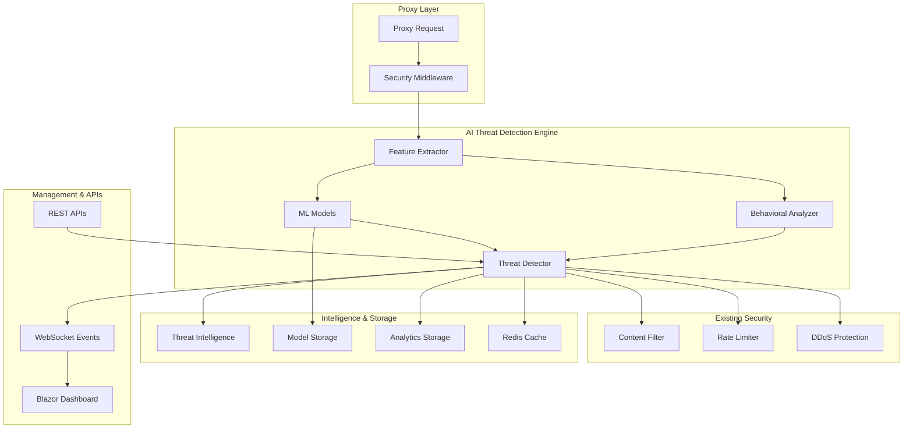

# Design Document

## Overview

The AI-Powered Threat Detection system enhances Dydoxy's existing security infrastructure with machine learning capabilities to detect sophisticated threats in real-time. The system integrates seamlessly with the current content filtering engine, rate limiting, and DDoS protection modules to provide comprehensive, adaptive security.

The design follows a layered architecture approach, building upon the existing `internal/security/filter` and `internal/security/ddos` modules. The AI system operates as both a standalone threat detection engine and an enhancement layer for existing security components.

## Architecture

### High-Level Architecture



### Component Architecture

The system consists of several key components organized within the existing Go backend structure:

#### Core AI Engine (`internal/security/ai/`)
- **Threat Detector**: Main orchestration component
- **ML Models**: Machine learning inference engines
- **Feature Extractor**: Converts requests to ML features
- **Behavioral Analyzer**: User/IP behavior profiling
- **Model Manager**: Handles model lifecycle and updates

#### Integration Layer (`internal/security/ai/integration/`)
- **Filter Integration**: Enhances content filtering with AI
- **Rate Limit Integration**: AI-driven adaptive rate limiting
- **DDoS Integration**: ML-enhanced attack detection

#### Intelligence Services (`internal/security/ai/intelligence/`)
- **Threat Feeds**: External threat intelligence integration
- **Pattern Recognition**: Attack pattern learning and matching
- **Anomaly Detection**: Statistical and ML-based anomaly detection

## Components and Interfaces

### Core Interfaces

```go
// AIThreatDetector is the main interface for AI-powered threat detection
type AIThreatDetector interface {
    // AnalyzeRequest performs comprehensive threat analysis
    AnalyzeRequest(ctx context.Context, request *ThreatAnalysisRequest) (*ThreatAnalysisResult, error)
    
    // UpdateModels updates ML models with new training data
    UpdateModels(ctx context.Context, trainingData []*TrainingExample) error
    
    // GetThreatIntelligence retrieves current threat intelligence
    GetThreatIntelligence(ctx context.Context, query *ThreatQuery) (*ThreatIntelligence, error)
    
    // ConfigurePolicies updates threat detection policies
    ConfigurePolicies(ctx context.Context, policies *ThreatPolicies) error
}

// MLModel represents a machine learning model for threat detection
type MLModel interface {
    // Predict performs inference on input features
    Predict(ctx context.Context, features map[string]float64) (*MLPrediction, error)
    
    // Train updates the model with new training data
    Train(ctx context.Context, examples []*TrainingExample) error
    
    // GetMetrics returns model performance metrics
    GetMetrics(ctx context.Context) (*ModelMetrics, error)
    
    // Export exports the model for backup or deployment
    Export(ctx context.Context) ([]byte, error)
}

// BehavioralAnalyzer analyzes user and IP behavior patterns
type BehavioralAnalyzer interface {
    // AnalyzeBehavior analyzes behavior for anomalies
    AnalyzeBehavior(ctx context.Context, subject string, request *RequestContext) (*BehaviorAnalysis, error)
    
    // UpdateProfile updates behavioral profile
    UpdateProfile(ctx context.Context, subject string, request *RequestContext) error
    
    // GetProfile retrieves behavioral profile
    GetProfile(ctx context.Context, subject string) (*BehaviorProfile, error)
}
```

### Data Models

```go
// ThreatAnalysisRequest represents a request for threat analysis
type ThreatAnalysisRequest struct {
    RequestID     string                 `json:"request_id"`
    SourceIP      net.IP                 `json:"source_ip"`
    UserID        string                 `json:"user_id,omitempty"`
    OrgID         string                 `json:"org_id,omitempty"`
    URL           string                 `json:"url"`
    Method        string                 `json:"method"`
    Headers       map[string]string      `json:"headers"`
    UserAgent     string                 `json:"user_agent"`
    ContentType   string                 `json:"content_type"`
    ContentLength int64                  `json:"content_length"`
    Body          []byte                 `json:"body,omitempty"`
    Timestamp     time.Time              `json:"timestamp"`
    Context       map[string]interface{} `json:"context,omitempty"`
}

// ThreatAnalysisResult contains the result of AI threat analysis
type ThreatAnalysisResult struct {
    RequestID        string             `json:"request_id"`
    IsThreat         bool               `json:"is_threat"`
    ThreatType       ThreatType         `json:"threat_type"`
    ThreatLevel      ThreatLevel        `json:"threat_level"`
    Confidence       float64            `json:"confidence"`
    MLPredictions    []*MLPrediction    `json:"ml_predictions"`
    BehaviorAnalysis *BehaviorAnalysis  `json:"behavior_analysis,omitempty"`
    RecommendedAction ActionType        `json:"recommended_action"`
    Reason           string             `json:"reason"`
    Metadata         map[string]interface{} `json:"metadata,omitempty"`
    ProcessingTime   time.Duration      `json:"processing_time"`
    Timestamp        time.Time          `json:"timestamp"`
}

// ThreatType defines different types of threats
type ThreatType string

const (
    ThreatTypeMalware          ThreatType = "malware"
    ThreatTypePhishing         ThreatType = "phishing"
    ThreatTypeBotnet           ThreatType = "botnet"
    ThreatTypeDataExfiltration ThreatType = "data_exfiltration"
    ThreatTypeCommandControl   ThreatType = "command_control"
    ThreatTypeAnomalous        ThreatType = "anomalous_behavior"
    ThreatTypeZeroDay          ThreatType = "zero_day"
    ThreatTypeInsiderThreat    ThreatType = "insider_threat"
)

// ActionType defines recommended actions
type ActionType string

const (
    ActionAllow       ActionType = "allow"
    ActionBlock       ActionType = "block"
    ActionQuarantine  ActionType = "quarantine"
    ActionChallenge   ActionType = "challenge"
    ActionRateLimit   ActionType = "rate_limit"
    ActionMonitor     ActionType = "monitor"
    ActionAlert       ActionType = "alert"
)
```

### ML Model Architecture

The system employs multiple specialized ML models:

#### 1. Content Analysis Model
- **Purpose**: Analyzes request content for malicious patterns
- **Input**: URL, headers, content type, body snippets
- **Output**: Malware/phishing probability
- **Algorithm**: Gradient Boosting (XGBoost) with text features

#### 2. Behavioral Analysis Model
- **Purpose**: Detects anomalous user/IP behavior
- **Input**: Request patterns, timing, frequency, locations
- **Output**: Anomaly score and behavior classification
- **Algorithm**: Isolation Forest + LSTM for sequence analysis

#### 3. Network Pattern Model
- **Purpose**: Identifies network-level attack patterns
- **Input**: Connection metadata, traffic patterns, protocol analysis
- **Output**: Network threat classification
- **Algorithm**: Random Forest with network features

#### 4. Zero-Day Detection Model
- **Purpose**: Detects previously unknown threats
- **Input**: Multi-dimensional feature vectors
- **Output**: Novel threat probability
- **Algorithm**: Autoencoder for anomaly detection

## Data Models

### Feature Engineering

The system extracts comprehensive features from each request:

```go
// FeatureVector represents extracted features for ML analysis
type FeatureVector struct {
    // Request features
    URLLength         float64 `json:"url_length"`
    URLEntropy        float64 `json:"url_entropy"`
    DomainAge         float64 `json:"domain_age"`
    SubdomainCount    float64 `json:"subdomain_count"`
    PathDepth         float64 `json:"path_depth"`
    QueryParamCount   float64 `json:"query_param_count"`
    
    // Content features
    ContentLength     float64 `json:"content_length"`
    HeaderCount       float64 `json:"header_count"`
    UserAgentEntropy  float64 `json:"user_agent_entropy"`
    
    // Behavioral features
    RequestFrequency  float64 `json:"request_frequency"`
    TimeOfDay         float64 `json:"time_of_day"`
    DayOfWeek         float64 `json:"day_of_week"`
    SessionDuration   float64 `json:"session_duration"`
    
    // Network features
    IPReputation      float64 `json:"ip_reputation"`
    GeoDistance       float64 `json:"geo_distance"`
    ASNReputation     float64 `json:"asn_reputation"`
    
    // Historical features
    PreviousViolations float64 `json:"previous_violations"`
    AccountAge        float64 `json:"account_age"`
    TrustScore        float64 `json:"trust_score"`
}
```

### Training Data Management

```go
// TrainingExample represents a labeled example for model training
type TrainingExample struct {
    ID           string                 `json:"id"`
    Features     map[string]float64     `json:"features"`
    Label        bool                   `json:"label"` // true = threat, false = benign
    ThreatType   ThreatType             `json:"threat_type,omitempty"`
    Confidence   float64                `json:"confidence"`
    Source       string                 `json:"source"` // human_labeled, automated, feedback
    Timestamp    time.Time              `json:"timestamp"`
    Metadata     map[string]interface{} `json:"metadata,omitempty"`
}
```

## Error Handling

### Graceful Degradation Strategy

The AI system implements multiple fallback mechanisms:

1. **Model Unavailable**: Falls back to signature-based detection
2. **High Latency**: Implements request queuing and async processing
3. **Low Confidence**: Combines multiple model predictions
4. **Training Data Issues**: Maintains model versioning and rollback

### Error Types

```go
// AIError represents errors in the AI threat detection system
type AIError struct {
    Code      ErrorCode `json:"code"`
    Message   string    `json:"message"`
    Component string    `json:"component"`
    Severity  Severity  `json:"severity"`
    Timestamp time.Time `json:"timestamp"`
    Context   map[string]interface{} `json:"context,omitempty"`
}

type ErrorCode string

const (
    ErrorModelUnavailable    ErrorCode = "MODEL_UNAVAILABLE"
    ErrorFeatureExtraction   ErrorCode = "FEATURE_EXTRACTION_FAILED"
    ErrorPredictionTimeout   ErrorCode = "PREDICTION_TIMEOUT"
    ErrorInsufficientData    ErrorCode = "INSUFFICIENT_DATA"
    ErrorModelPerformance    ErrorCode = "MODEL_PERFORMANCE_DEGRADED"
)
```

## Testing Strategy

### Unit Testing
- **Model Testing**: Validate ML model predictions with known datasets
- **Feature Extraction**: Test feature engineering with various request types
- **Integration Testing**: Verify integration with existing security components

### Performance Testing
- **Latency Requirements**: <50ms for real-time analysis
- **Throughput Testing**: Handle 10,000+ requests per second
- **Memory Usage**: Monitor model memory consumption

### Security Testing
- **Adversarial Testing**: Test against adversarial ML attacks
- **False Positive Analysis**: Minimize legitimate traffic blocking
- **Model Poisoning**: Protect against training data manipulation

### Integration Testing

```go
// Test integration with existing content filter
func TestAIContentFilterIntegration(t *testing.T) {
    // Setup AI detector and content filter
    aiDetector := setupAIDetector()
    contentFilter := setupContentFilter()
    
    // Create enhanced filter with AI
    enhancedFilter := NewAIEnhancedContentFilter(contentFilter, aiDetector)
    
    // Test various threat scenarios
    testCases := []struct {
        name     string
        request  *ContentRequest
        expected bool
    }{
        {"Known malware URL", malwareRequest, false},
        {"Suspicious behavior", suspiciousRequest, false},
        {"Legitimate request", legitimateRequest, true},
    }
    
    for _, tc := range testCases {
        t.Run(tc.name, func(t *testing.T) {
            result, err := enhancedFilter.Filter(context.Background(), tc.request)
            assert.NoError(t, err)
            assert.Equal(t, tc.expected, result.Allowed)
        })
    }
}
```

## Performance Considerations

### Optimization Strategies

1. **Model Optimization**
   - Use quantized models for faster inference
   - Implement model caching and warm-up
   - Batch processing for multiple requests

2. **Feature Caching**
   - Cache computed features in Redis
   - Implement feature versioning
   - Use bloom filters for quick lookups

3. **Async Processing**
   - Queue non-critical analysis tasks
   - Implement circuit breakers
   - Use worker pools for parallel processing

### Monitoring and Metrics

```go
// AIMetrics tracks performance and accuracy metrics
type AIMetrics struct {
    // Performance metrics
    AverageLatency    time.Duration `json:"average_latency"`
    ThroughputRPS     float64       `json:"throughput_rps"`
    ErrorRate         float64       `json:"error_rate"`
    
    // Accuracy metrics
    TruePositives     int64   `json:"true_positives"`
    FalsePositives    int64   `json:"false_positives"`
    TrueNegatives     int64   `json:"true_negatives"`
    FalseNegatives    int64   `json:"false_negatives"`
    Precision         float64 `json:"precision"`
    Recall            float64 `json:"recall"`
    F1Score           float64 `json:"f1_score"`
    
    // Model metrics
    ModelVersion      string    `json:"model_version"`
    LastTraining      time.Time `json:"last_training"`
    TrainingAccuracy  float64   `json:"training_accuracy"`
    ValidationAccuracy float64  `json:"validation_accuracy"`
}
```

## Integration Points

### Content Filter Enhancement

The AI system enhances the existing content filter by:

```go
// AIEnhancedContentFilter wraps the existing content filter with AI capabilities
type AIEnhancedContentFilter struct {
    baseFilter  filter.ContentFilter
    aiDetector  AIThreatDetector
    config      *AIFilterConfig
    logger      *logrus.Logger
}

func (f *AIEnhancedContentFilter) Filter(ctx context.Context, request *filter.ContentRequest) (*filter.FilterResult, error) {
    // First run traditional content filtering
    baseResult, err := f.baseFilter.Filter(ctx, request)
    if err != nil {
        return nil, err
    }
    
    // If blocked by traditional rules, return immediately
    if !baseResult.Allowed {
        return baseResult, nil
    }
    
    // Run AI analysis for allowed requests
    aiRequest := f.convertToAIRequest(request)
    aiResult, err := f.aiDetector.AnalyzeRequest(ctx, aiRequest)
    if err != nil {
        // Log error but don't fail the request
        f.logger.Errorf("AI analysis failed: %v", err)
        return baseResult, nil
    }
    
    // Combine results
    return f.combineResults(baseResult, aiResult), nil
}
```

### Rate Limiting Integration

AI-driven adaptive rate limiting:

```go
// AIAdaptiveRateLimiter adjusts rate limits based on threat analysis
type AIAdaptiveRateLimiter struct {
    baseLimiter ratelimit.RateLimiter
    aiDetector  AIThreatDetector
    config      *AIRateLimitConfig
}

func (l *AIAdaptiveRateLimiter) Allow(ctx context.Context, key string, request *ratelimit.Request) (*ratelimit.Result, error) {
    // Get AI threat analysis
    aiResult, err := l.aiDetector.AnalyzeRequest(ctx, convertToAIRequest(request))
    if err == nil && aiResult.IsThreat {
        // Apply stricter limits for threats
        return l.applyThreatLimits(ctx, key, request, aiResult)
    }
    
    // Use normal rate limiting
    return l.baseLimiter.Allow(ctx, key, request)
}
```

### Real-time Dashboard Integration

WebSocket events for real-time threat monitoring:

```go
// ThreatEvent represents a real-time threat detection event
type ThreatEvent struct {
    ID           string      `json:"id"`
    Type         ThreatType  `json:"type"`
    Level        ThreatLevel `json:"level"`
    SourceIP     string      `json:"source_ip"`
    UserID       string      `json:"user_id,omitempty"`
    URL          string      `json:"url"`
    Action       ActionType  `json:"action"`
    Confidence   float64     `json:"confidence"`
    Timestamp    time.Time   `json:"timestamp"`
}
```

The system integrates with the existing SignalR infrastructure to provide real-time threat notifications to the Blazor dashboard, enabling security administrators to monitor and respond to threats as they occur.