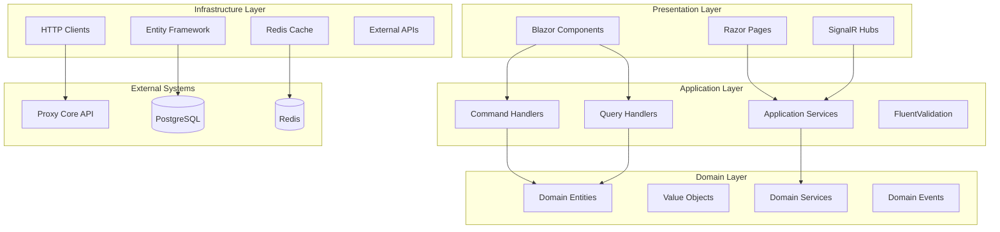

# Dydoxy Blazor Server Frontend - Design Document

## Overview

The Dydoxy Blazor Server frontend is a comprehensive web application built with .NET 9 and Blazor Server, providing real-time management capabilities for the Dydoxy proxy system. The application follows Clean Architecture principles with a modular monolith approach, featuring real-time updates via SignalR, comprehensive dashboards, and enterprise-grade security features.

## Architecture

### High-Level Architecture



### Modular Structure

The application is organized into self-contained modules:

1. **Users Module** - User management, authentication, roles
2. **Proxy Module** - Proxy server management and monitoring
3. **Security Module** - AI threat detection, content filtering, security policies
4. **Analytics Module** - Usage analytics, reporting, dashboards
5. **Billing Module** - Subscription management, usage tracking, invoicing
6. **Shared Module** - Common contracts, infrastructure, utilities

### Technology Stack

- **.NET 9** - Latest framework with enhanced performance
- **Blazor Server** - Server-side rendering with real-time updates
- **SignalR** - Real-time communication
- **Entity Framework Core** - Data access with PostgreSQL
- **MudBlazor** - Rich UI component library
- **MediatR** - CQRS implementation
- **FluentValidation** - Input validation
- **Refit** - Type-safe HTTP clients
- **AutoMapper** - Object mapping
- **Serilog** - Structured logging

## Components and Interfaces

### Core Components

#### 1. Blazor Components Architecture

```csharp
// Base component with common functionality
public abstract class DydoxyComponentBase : ComponentBase, IDisposable
{
    [Inject] protected IMediator Mediator { get; set; }
    [Inject] protected IMapper Mapper { get; set; }
    [Inject] protected ILogger Logger { get; set; }
    [Inject] protected ISnackbar Snackbar { get; set; }
    
    protected virtual Task HandleErrorAsync(Exception exception);
    protected virtual Task ShowSuccessMessageAsync(string message);
    protected virtual Task ShowErrorMessageAsync(string message);
}

// Dashboard component base
public abstract class DashboardComponentBase : DydoxyComponentBase
{
    [Inject] protected HubConnection HubConnection { get; set; }
    
    protected override async Task OnInitializedAsync()
    {
        await ConnectToHub();
        await LoadInitialData();
    }
    
    protected abstract Task LoadInitialData();
    protected abstract Task ConnectToHub();
}
```

#### 2. CQRS Implementation

```csharp
// Command example
public record CreateUserCommand(
    string Email,
    string FirstName,
    string LastName,
    List<string> Roles
) : IRequest<Result<Guid>>;

// Command handler
public class CreateUserHandler : IRequestHandler<CreateUserCommand, Result<Guid>>
{
    private readonly IUserRepository _repository;
    private readonly IValidator<CreateUserCommand> _validator;
    
    public async Task<Result<Guid>> Handle(CreateUserCommand request, CancellationToken cancellationToken)
    {
        var validationResult = await _validator.ValidateAsync(request, cancellationToken);
        if (!validationResult.IsValid)
            return Result<Guid>.Failure(new ValidationError(validationResult.Errors));
            
        var user = User.Create(request.Email, request.FirstName, request.LastName);
        await _repository.AddAsync(user, cancellationToken);
        
        return Result<Guid>.Success(user.Id);
    }
}

// Query example
public record GetUsersQuery(
    int Page = 1,
    int PageSize = 20,
    string? SearchTerm = null,
    string? SortBy = null
) : IRequest<Result<PagedResult<UserDto>>>;
```

#### 3. SignalR Hubs

```csharp
// Real-time dashboard hub
public class DashboardHub : Hub
{
    public async Task JoinDashboardGroup(string dashboardType)
    {
        await Groups.AddToGroupAsync(Context.ConnectionId, $"Dashboard_{dashboardType}");
    }
    
    public async Task LeaveDashboardGroup(string dashboardType)
    {
        await Groups.RemoveFromGroupAsync(Context.ConnectionId, $"Dashboard_{dashboardType}");
    }
}

// Notification hub
public class NotificationHub : Hub
{
    public async Task JoinUserGroup(string userId)
    {
        await Groups.AddToGroupAsync(Context.ConnectionId, $"User_{userId}");
    }
}
```

### Module Interfaces

#### 1. Users Module

```csharp
public interface IUserService
{
    Task<Result<PagedResult<UserDto>>> GetUsersAsync(GetUsersQuery query);
    Task<Result<UserDto>> GetUserByIdAsync(Guid id);
    Task<Result<Guid>> CreateUserAsync(CreateUserCommand command);
    Task<Result> UpdateUserAsync(UpdateUserCommand command);
    Task<Result> DeleteUserAsync(Guid id);
}

public interface IAuthenticationService
{
    Task<Result<AuthenticationResult>> AuthenticateAsync(string email, string password);
    Task<Result> LogoutAsync();
    Task<Result<UserDto>> GetCurrentUserAsync();
}
```

#### 2. Proxy Module

```csharp
public interface IProxyService
{
    Task<Result<PagedResult<ProxyServerDto>>> GetProxyServersAsync(GetProxyServersQuery query);
    Task<Result<ProxyServerDto>> GetProxyServerByIdAsync(Guid id);
    Task<Result<ProxyMetricsDto>> GetProxyMetricsAsync(Guid proxyId, TimeRange timeRange);
    Task<Result> UpdateProxyConfigurationAsync(UpdateProxyConfigCommand command);
}

public interface IProxyMonitoringService
{
    Task<Result<List<ProxyConnectionDto>>> GetActiveConnectionsAsync(Guid proxyId);
    Task<Result<ProxyHealthDto>> GetProxyHealthAsync(Guid proxyId);
    Task<Result> RestartProxyAsync(Guid proxyId);
}
```

#### 3. Security Module

```csharp
public interface ISecurityService
{
    Task<Result<SecurityDashboardDto>> GetSecurityDashboardAsync();
    Task<Result<PagedResult<ThreatEventDto>>> GetThreatEventsAsync(GetThreatEventsQuery query);
    Task<Result<AIModelMetricsDto>> GetAIModelMetricsAsync();
    Task<Result> UpdateThreatPolicyAsync(UpdateThreatPolicyCommand command);
}

public interface IContentFilterService
{
    Task<Result<PagedResult<FilterRuleDto>>> GetFilterRulesAsync(GetFilterRulesQuery query);
    Task<Result<Guid>> CreateFilterRuleAsync(CreateFilterRuleCommand command);
    Task<Result> UpdateFilterRuleAsync(UpdateFilterRuleCommand command);
    Task<Result> TestFilterRuleAsync(TestFilterRuleCommand command);
}
```

## Data Models

### Domain Entities

```csharp
// User aggregate
public class User : AggregateRoot<Guid>
{
    public Email Email { get; private set; }
    public PersonName Name { get; private set; }
    public UserStatus Status { get; private set; }
    public List<Role> Roles { get; private set; }
    public DateTime CreatedAt { get; private set; }
    public DateTime? LastLoginAt { get; private set; }
    
    public static User Create(string email, string firstName, string lastName)
    {
        var user = new User
        {
            Id = Guid.NewGuid(),
            Email = Email.Create(email),
            Name = PersonName.Create(firstName, lastName),
            Status = UserStatus.Active,
            CreatedAt = DateTime.UtcNow,
            Roles = new List<Role>()
        };
        
        user.AddDomainEvent(new UserCreatedEvent(user.Id, user.Email.Value));
        return user;
    }
}

// Proxy server aggregate
public class ProxyServer : AggregateRoot<Guid>
{
    public string Name { get; private set; }
    public ProxyType Type { get; private set; }
    public EndPoint EndPoint { get; private set; }
    public ProxyConfiguration Configuration { get; private set; }
    public ProxyStatus Status { get; private set; }
    public ProxyMetrics Metrics { get; private set; }
    
    public void UpdateConfiguration(ProxyConfiguration configuration)
    {
        Configuration = configuration;
        AddDomainEvent(new ProxyConfigurationUpdatedEvent(Id, configuration));
    }
}
```

### DTOs and View Models

```csharp
// User DTOs
public record UserDto(
    Guid Id,
    string Email,
    string FirstName,
    string LastName,
    string Status,
    List<string> Roles,
    DateTime CreatedAt,
    DateTime? LastLoginAt
);

public record CreateUserDto(
    string Email,
    string FirstName,
    string LastName,
    List<string> Roles
);

// Dashboard DTOs
public record SecurityDashboardDto(
    int TotalThreats,
    int ActiveAlerts,
    double ThreatScore,
    List<ThreatCategoryDto> ThreatCategories,
    List<RecentThreatDto> RecentThreats,
    AIModelStatusDto ModelStatus
);

public record ProxyDashboardDto(
    int TotalProxies,
    int ActiveConnections,
    double AverageResponseTime,
    long TotalBandwidth,
    List<ProxyServerStatusDto> ProxyStatuses
);
```

## Error Handling

### Result Pattern Implementation

```csharp
public record Result<T>
{
    public bool IsSuccess { get; init; }
    public T? Value { get; init; }
    public Error? Error { get; init; }
    
    public static Result<T> Success(T value) => new() { IsSuccess = true, Value = value };
    public static Result<T> Failure(Error error) => new() { IsSuccess = false, Error = error };
}

public abstract record Error(string Message, string Code);
public record ValidationError(List<ValidationFailure> Failures) : Error("Validation failed", "VALIDATION_ERROR");
public record NotFoundError(string Resource, string Id) : Error($"{Resource} with id {Id} not found", "NOT_FOUND");
public record BusinessRuleError(string Rule) : Error($"Business rule violation: {Rule}", "BUSINESS_RULE_ERROR");
```

### Global Error Handling

```csharp
public class GlobalErrorHandler : IErrorHandler
{
    private readonly ILogger<GlobalErrorHandler> _logger;
    private readonly ISnackbar _snackbar;
    
    public async Task HandleErrorAsync(Exception exception, ComponentBase component)
    {
        _logger.LogError(exception, "Unhandled error in component {ComponentType}", component.GetType().Name);
        
        var message = exception switch
        {
            ValidationException => "Please check your input and try again",
            UnauthorizedAccessException => "You don't have permission to perform this action",
            HttpRequestException => "Unable to connect to the server. Please try again later",
            _ => "An unexpected error occurred. Please try again"
        };
        
        _snackbar.Add(message, Severity.Error);
    }
}
```

## Testing Strategy

### Unit Testing

```csharp
public class CreateUserHandlerTests
{
    private readonly Mock<IUserRepository> _repositoryMock;
    private readonly Mock<IValidator<CreateUserCommand>> _validatorMock;
    private readonly CreateUserHandler _handler;
    
    [Fact]
    public async Task Handle_ValidCommand_ReturnsSuccessResult()
    {
        // Arrange
        var command = new CreateUserCommand("test@example.com", "John", "Doe", new List<string> { "User" });
        _validatorMock.Setup(x => x.ValidateAsync(command, default))
            .ReturnsAsync(new ValidationResult());
        
        // Act
        var result = await _handler.Handle(command, default);
        
        // Assert
        result.IsSuccess.Should().BeTrue();
        result.Value.Should().NotBeEmpty();
    }
}
```

### Integration Testing

```csharp
public class UserControllerTests : IClassFixture<WebApplicationFactory<Program>>
{
    private readonly WebApplicationFactory<Program> _factory;
    private readonly HttpClient _client;
    
    [Fact]
    public async Task GetUsers_ReturnsPagedResult()
    {
        // Arrange
        var request = new GetUsersQuery(Page: 1, PageSize: 10);
        
        // Act
        var response = await _client.PostAsJsonAsync("/api/users/search", request);
        
        // Assert
        response.StatusCode.Should().Be(HttpStatusCode.OK);
        var result = await response.Content.ReadFromJsonAsync<PagedResult<UserDto>>();
        result.Should().NotBeNull();
    }
}
```

### Component Testing with bUnit

```csharp
public class UserListComponentTests : TestContext
{
    [Fact]
    public void UserList_RendersCorrectly()
    {
        // Arrange
        var users = new List<UserDto>
        {
            new(Guid.NewGuid(), "test@example.com", "John", "Doe", "Active", new List<string> { "User" }, DateTime.UtcNow, null)
        };
        
        Services.AddSingleton(Mock.Of<IUserService>(x => 
            x.GetUsersAsync(It.IsAny<GetUsersQuery>()) == Task.FromResult(Result<PagedResult<UserDto>>.Success(new PagedResult<UserDto>(users, 1, 1, 10)))));
        
        // Act
        var component = RenderComponent<UserListComponent>();
        
        // Assert
        component.Find("table").Should().NotBeNull();
        component.FindAll("tr").Count.Should().Be(2); // Header + 1 data row
    }
}
```

## Performance Considerations

### Caching Strategy

```csharp
public class CachedUserService : IUserService
{
    private readonly IUserService _userService;
    private readonly IMemoryCache _cache;
    private readonly IDistributedCache _distributedCache;
    
    public async Task<Result<UserDto>> GetUserByIdAsync(Guid id)
    {
        var cacheKey = $"user:{id}";
        
        if (_cache.TryGetValue(cacheKey, out UserDto cachedUser))
            return Result<UserDto>.Success(cachedUser);
        
        var result = await _userService.GetUserByIdAsync(id);
        if (result.IsSuccess)
        {
            _cache.Set(cacheKey, result.Value, TimeSpan.FromMinutes(15));
        }
        
        return result;
    }
}
```

### SignalR Optimization

```csharp
public class OptimizedDashboardHub : Hub
{
    private readonly IConnectionManager _connectionManager;
    
    public async Task JoinDashboard(string dashboardType)
    {
        await Groups.AddToGroupAsync(Context.ConnectionId, $"Dashboard_{dashboardType}");
        
        // Send initial data only to this connection
        var initialData = await GetInitialDashboardData(dashboardType);
        await Clients.Caller.SendAsync("InitialData", initialData);
    }
    
    // Batch updates to reduce SignalR overhead
    public async Task SendBatchedUpdates(string groupName, List<object> updates)
    {
        await Clients.Group(groupName).SendAsync("BatchUpdate", updates);
    }
}
```

### Database Optimization

```csharp
public class OptimizedUserRepository : IUserRepository
{
    private readonly ApplicationDbContext _context;
    
    public async Task<PagedResult<User>> GetUsersAsync(GetUsersQuery query)
    {
        var queryable = _context.Users
            .AsNoTracking() // Read-only queries
            .Include(u => u.Roles)
            .AsSplitQuery(); // Avoid cartesian explosion
        
        if (!string.IsNullOrEmpty(query.SearchTerm))
        {
            queryable = queryable.Where(u => 
                EF.Functions.ILike(u.Email.Value, $"%{query.SearchTerm}%") ||
                EF.Functions.ILike(u.Name.FirstName, $"%{query.SearchTerm}%"));
        }
        
        var totalCount = await queryable.CountAsync();
        var users = await queryable
            .Skip((query.Page - 1) * query.PageSize)
            .Take(query.PageSize)
            .ToListAsync();
        
        return new PagedResult<User>(users, totalCount, query.Page, query.PageSize);
    }
}
```

## Security Implementation

### Authentication and Authorization

```csharp
public class CustomAuthenticationStateProvider : AuthenticationStateProvider
{
    private readonly ITokenService _tokenService;
    private readonly IJSRuntime _jsRuntime;
    
    public override async Task<AuthenticationState> GetAuthenticationStateAsync()
    {
        var token = await _jsRuntime.InvokeAsync<string>("localStorage.getItem", "authToken");
        
        if (string.IsNullOrEmpty(token) || _tokenService.IsTokenExpired(token))
        {
            return new AuthenticationState(new ClaimsPrincipal(new ClaimsIdentity()));
        }
        
        var claims = _tokenService.GetClaimsFromToken(token);
        var identity = new ClaimsIdentity(claims, "jwt");
        
        return new AuthenticationState(new ClaimsPrincipal(identity));
    }
}

// Authorization policy
public static class Policies
{
    public const string AdminOnly = "AdminOnly";
    public const string UserManagement = "UserManagement";
    public const string ProxyManagement = "ProxyManagement";
    public const string SecurityManagement = "SecurityManagement";
}
```

### Input Validation

```csharp
public class CreateUserCommandValidator : AbstractValidator<CreateUserCommand>
{
    public CreateUserCommandValidator()
    {
        RuleFor(x => x.Email)
            .NotEmpty()
            .EmailAddress()
            .MaximumLength(255);
            
        RuleFor(x => x.FirstName)
            .NotEmpty()
            .MaximumLength(100)
            .Matches("^[a-zA-Z\\s]+$");
            
        RuleFor(x => x.LastName)
            .NotEmpty()
            .MaximumLength(100)
            .Matches("^[a-zA-Z\\s]+$");
            
        RuleFor(x => x.Roles)
            .NotEmpty()
            .Must(roles => roles.All(role => ValidRoles.Contains(role)))
            .WithMessage("Invalid role specified");
    }
}
```

This design provides a comprehensive foundation for the Blazor Server frontend, ensuring scalability, maintainability, and excellent user experience while integrating seamlessly with the Go backend services.